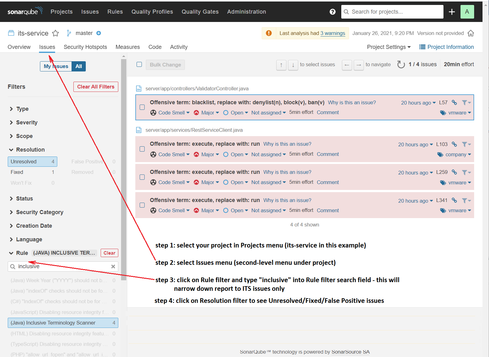
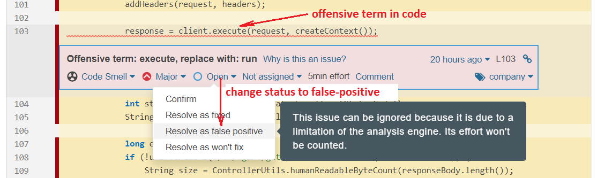

# inclusive-language-ext-for-sonarqube

## Overview
This extension adds "Inclusive Terminology Rule" to the list of static analysis rules in SonarQube.

Inclusive Terminilogy Scanner is implemented as plugin for Sonar. Sonar provides following features:

- detect: scan source code for ITS issues during build phase in build pipelines
- analyze/fix: convenient web UI to help you find and correct ITS issues in code, and resolve or mark as false-positives in Sonar 
- report: reports for open/fixed/resolved ITS issues in project dashboard

### Prerequisites

* Maven
* Java 8 or higher

### Build & Run

1. run "mvn package" to build extension for Sonar version 8.x, or run build.sh script 
2. Follow steps on https://docs.sonarqube.org/latest/setup/install-plugin/ for insructions how to install extension
3. After Sonar restart, add new "Inclusive Terminology Rule" to default Java profile. This rule will be applied to all projects during scanning (both java and non-java projects), and issues will be reported in Sonar dashboard.

## Documentation

** Analyzing Reports **
By default Sonar dashboard shows all issues in your project, including bugs, cosmetic, code complexity, security and finally ITS offensive terms.

To narrow down report to ITS issues only, follow these steps:

- select your project in Projects menu
- select Issues submenu
- click on Rule filter to expand, and type "inclusive" into filter search box. This will select a single rule Inclusive Terminology Scanner, and show only issues detected by this rule. If this rule is not visible in the list then this means that project does not have any issues related to ITS.
- narrow down Unresolved/Fixed/False Positive issues by using Resolution filter
Note: URL for this Sonar report can be bookmarked. Report can be easily accessed later in 1 bookmark click and will not require repeating steps 1-4.

** To analyze and fix issues **

- select issue in report and click it - this opens source code page with issue analysis
- review line of source code where issue is reported
- for valid problem (e.g. using offensive term "blacklist" in comment text), go to source code location in your IDE and change code/comment 
- for false positive (e.g. using java API task.execute()), click on Issue Status combobox (in this case "Open") and select "False Positive". In confirmation dialog enter comment why this is "False Positive" (e.g. "standard java API, cannot change")
- issues which are fixed in code will be marked as Status=Resolved after next scan 

## Contributing

The inclusive-language-ext-for-sonarqube project team welcomes contributions from the community. Before you start working with inclusive-language-ext-for-sonarqube, please
read our [Developer Certificate of Origin](https://cla.vmware.com/dco). All contributions to this repository must be
signed as described on that page. Your signature certifies that you wrote the patch or have the right to pass it on
as an open-source patch. For more detailed information, refer to [CONTRIBUTING.md](CONTRIBUTING.md).

